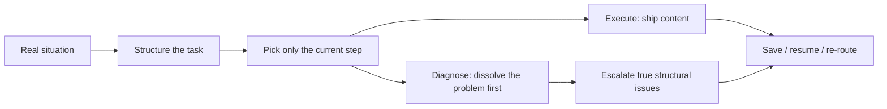

# Siyu Expert Team · Majia Field Edition

[](https://github.com/maojiebc/majia-siyu-team/releases)
[](./LICENSE)
[](https://clawhub.ai/s/majia-siyu)
[](https://skillhub.cn)
[](https://skills.sh/maojiebc/majia-siyu-team)
[](https://github.com/maojiebc/majia-siyu-team/releases)

> **Siyu Expert Team · 马甲实战版**
>
> A Chinese private-domain (WeCom / 私域) operations toolbox. One entry point — `/siyu` — routes you to the single most useful capability, runs it, then re-routes from the real outcome.

<p align="center">
  
</p>

<p align="center">
  
</p>

> **In one glance**: describe a real situation → `/siyu` picks only the current step → high-frequency work (Moments / group broadcast / welcome scripts) ships with write-time compliance → true structural issues escalate to four isolated officers → results can be saved, resumed, and reported. Operating actions live here; membership metrics / SQL / warehouses belong in [majia-huiyuan](https://github.com/maojiebc/majia-huiyuan).

---

**Where to go:**

| I want to… | Go to |
|---|---|
| Start for the first time | [Quick start](#quick-start) → type `/siyu` |
| Write Moments / broadcasts / welcome copy | [Capability map · execution](#2-high-frequency-execution) |
| Diagnose conversion or quiet groups | [Capability map · diagnosis](#3-diagnosis--research) |
| Compare SCRM vendors or verify pricing | `siyu-market-research` |
| Design the whole private-domain system | owner guide or `siyu-onboard` |
| Resume last client thread / ship a report | `/siyu-save` · `/siyu-restore` · `/siyu-report` |
| Install for an AI agent | [Install](#install) |

Full Chinese manual: [README.md](./README.md).

## What it is

Private-domain work usually falls into three buckets:

1. **Daily writing** — Moments, group pushes, welcome scripts (and compliance risk)
2. **Occasional judgment** — is the drop a copy problem or a mechanism problem? can this vendor/price be trusted?
3. **Heavy but rare** — whole-system design, client memory, handoff reports

Generic copy tools cover most of bucket 1. This toolbox finishes the last 20% and also covers buckets 2–3:

- **One entry** — remember `/siyu`, not 17 skill names
- **Write-time compliance** — blocks WeCom-ban triggers, absolute ad-law claims, share-bait before output ships
- **External-fact gate** — vendors, products, pricing, and policy require live research with dated sources
- **Escalate only when structural** — four experts review in isolation; compliance has veto power
- **Continuity** — local client archives for save / resume / report

The public repo ships framework, methodology, and installable Skills. Real client operating SOPs stay private.

## Capability map

### 1. Entry

| Skill | When | Output |
|---|---|---|
| `/siyu` | Unknown next step | Tutorial, routing, post-task navigation |
| `/siyu-update` | Upgrade the toolbox | Sync official project; never touch local client files |

### 2. High-frequency execution

| Skill | When | Output |
|---|---|---|
| `/siyu-pyq` | Moments / content pool | Ready-to-post Moments copy |
| `/siyu-qunfa` | Group broadcast / campaigns | Scripts, CTA, mechanism notes |
| `/siyu-huashu` | Welcome / FAQ / ice-break | Scenario scripts + account IP templates |

### 3. Diagnosis & research

| Skill | When | Output |
|---|---|---|
| `siyu-wenzhen` | Concrete ops problems | 5-layer diagnosis or clear prescription |
| `siyu-market-research` | Vendor / competitor / pricing | Evidence snapshot with links and dates |
| `siyu-onboard` | Whole-system design | Four-officer playbook |
| Client archive trio | Save / resume / deliver | `/siyu-save` · `/siyu-restore` · `/siyu-report` |

One WorkBuddy / CodeBuddy install = **17 skills + 4 specialist agents + orchestrator**. ClawHub / SkillHub ship the same self-contained entry package; modules route internally and are not separate store listings.

## Quick start

```text
/siyu
```

Or just describe the situation:

```text
We pushed three campaign rounds to store groups and open rates are still low. Fix the copy first, or fix the group mechanism?
```

## Install

### WorkBuddy / CodeBuddy (recommended)

```bash
/plugin marketplace add maojiebc/majia-siyu-team
/plugin install majia-siyu@majia-siyu
```

### ClawHub / SkillHub

```bash
clawhub install majia-siyu
skillhub install siyu
```

ClawHub uses `majia-siyu`. SkillHub keeps the historical store identity `siyu` so downloads, stars, and version history stay attached. Code, GitHub source, and WorkBuddy plugin all use `majia-siyu`.

### skills.sh / Claude Code

```bash
npx -y skills add maojiebc/majia-siyu-team -g --all
claude plugin marketplace add maojiebc/majia-siyu-team
```

## How it works



1. **Evidence** — live research for vendors, pricing, cases, policy; no recommendation without sources  
2. **Planning** — natural language becomes a structured task; ask only the one field that unblocks routing  
3. **Execution** — Moments / broadcast / scripts with built-in compliance  
4. **Diagnosis** — four isolated officers + host quality gate + compliance veto  
5. **Foundation** — local state, redacted traces, layered knowledge contract, connector stubs (online submit/retrieve not enabled by default)

runtime backend notes: [`docs/runtime-v0.4.md`](docs/runtime-v0.4.md) · knowledge contract: [`docs/knowledge-runtime.md`](docs/knowledge-runtime.md).

## Community knowledge pilot (invitation only)

This release validates knowledge value, contribution demand, and editorial throughput. No real H1/H2/H3 result is claimed yet.

- [Feishu collaboration space](https://supermjbc.feishu.cn/wiki/XdrvwbtIyif61Pku8yQcSCj6nWf)
- [Field case form](https://supermjbc.feishu.cn/share/base/form/shrcnLsRQgaQJilUGNg6BjBXflg)
- [Pilot protocol](docs/pilot/README.md)

Feishu is intake + human review only — not a runtime source. No auto-approval, retrieval, or runtime injection in this release.

## Methodology

- **Private domain = PR** — relationship, reputation, trust; not a harvest field  
- **Content = product** — every piece needs a hook, a handoff, and reuse value  
- **Ops = ads** — every operating action should carry its own distribution and conversion  

## Version history

- **v1.2.9** — Runtime hardening: scored kind routing, weighted compliance penalties, path constants, external host prompt, trace cleanup, and regression tests.
- **v1.2.8** — Growth atoms approved into Pilot formal set; diagnosis still injects by industry.
- **v1.2.7** — Diagnosis/strategy contexts attach growth draft atoms (L0/L1 by industry).
- **v1.2.6** — Growth L0/L1 routing: no industry → L0 only; catering/retail → L0+L1.
- **v1.2.5** — Same growth know-how map as 1.2.4; SkillHub channel synced (store 1.2.4 slot anomaly, content unchanged).  
- **v1.2.4** — Public catering/retail growth know-how map (16 statements, metric dictionary, 9-point checkup); skills can cite it; still no runtime backend auto-inject.  
- **v1.2.3** — Fix SkillHub detail title: temp package aligns name=slug so the page title shows the Chinese brand name. No API change.  
- **v1.2.2** — Public page refresh: role navigation, full capability map, channel-split install, CN/EN + ClawHub package page alignment. No API/behavior change.  
- **v1.2.1** — Offline knowledge pilot, 30 Golden Tasks, editorial throughput report.  
- **v1.2.0** — `KnowledgeAtomV2` contract and contribution safety layer.  
- **v1.1.0** — External-fact hard gate + `siyu-market-research`.  

Full history: [CHANGELOG.md](./CHANGELOG.md).

## 👤 Author / Contact

**Majia (@maojiebc)** · 超级马甲 (Super Majia)

If this skill helps you, find me on any of these channels — happy to chat about field experience, take feature requests, hear bug reports, or trade notes on user operations / data platforms / BI engineering work:

| Channel | Link |
|---|---|
| 📧 Email | [m9224@163.com](mailto:m9224@163.com) |
| 🐙 GitHub | [github.com/maojiebc](https://github.com/maojiebc) |
| 🪝 ClawHub | [clawhub.ai/p/maojiebc](https://clawhub.ai/p/maojiebc) |
| 🐦 X | [@maojiebc](https://x.com/maojiebc) |
| 📕 Xiaohongshu | [Super Majia](https://xhslink.com/m/4fQMJeHHWKC) |
| 📰 WeChat Official Account | [超级马甲](https://mp.weixin.qq.com/mp/profile_ext?action=home&__biz=MzY5NzIzODk2NA==#wechat_redirect) |

> Built from 14 years of user-operations work and hands-on data platform & BI engineering in production.

## License

MIT © 2026 Majia (maojiebc). The public repository contains the framework and methodology; private operating SOPs are excluded.
