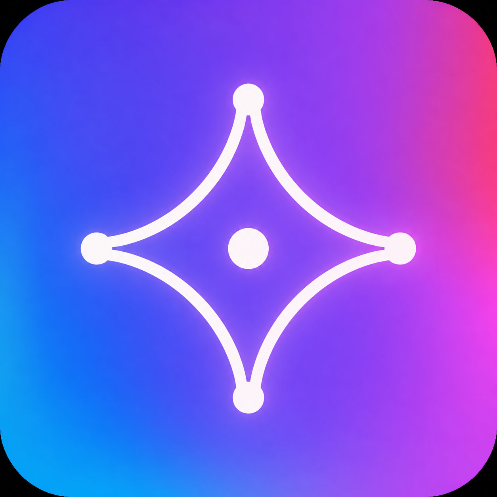

# Siyu Expert Team · Majia Field Edition

[](https://github.com/maojiebc/majia-siyu-team/releases)
[](./LICENSE)

> **Siyu Expert Team · 马甲实战版**
>
> A Chinese private-domain (WeCom / 私域) operations toolbox. Install one plugin, enter through `/siyu`, and let the router select the right specialist.

<p align="center">
  
</p>


## What it does

`/siyu` picks the single most useful capability for your current situation, runs it, then re-routes based on the real outcome — no fixed long chain.

- **Planning layer**: natural language becomes a validated `Task`, then a deterministic `RouteDecision`.
- **Execution layer**: `siyu-pyq` (Moments copy), `siyu-qunfa` (group broadcast), `siyu-huashu` (welcome & FAQ scripts) — each with **write-time compliance scanning** (blocks WeCom-ban triggers / absolute-claim ad-law words / share-bait).
- **Diagnostic layer**: structural issues escalate to four isolated officer contexts (PR / product / ads / compliance), host synthesis, and a quality gate.
- **Runtime foundation**: atomic state storage, redacted JSONL traces, layered knowledge, and connector boundaries.

Technical architecture: [`docs/runtime-v0.4.md`](docs/runtime-v0.4.md).

## Install

### WorkBuddy / CodeBuddy — one plugin

```bash
/plugin marketplace add maojiebc/majia-siyu-team
/plugin install siyu@siyu-expert-team
```

The repository's `.codebuddy-plugin/` manifest exposes the full team as one plugin: 16 skills, four specialist agents, and one `/siyu` entry point.

### ClawHub / SkillHub — one bundled skill

Install the single published entry `majia-siyu-team` on ClawHub or `siyu` on SkillHub. The release bundle embeds the router and all internal modules, so users do not need to install the specialists separately.

### Generic Skills CLI

```bash
npx -y skills add maojiebc/majia-siyu-team -g --all
```

## Version History

- **v0.8.0** — One-install distribution: WorkBuddy / CodeBuddy now sees the entire expert team as one plugin, while ClawHub and SkillHub receive a self-contained single-entry bundle. Added a unified minimalist icon and reproducible bundle builder.
- **v0.7.0** — Universal-compatibility layer: a zero-dependency "how to build private-domain · restaurant-owner edition" guide (plain language + a shareable map + an interactive page, works even where only the entry skill is installed); entry point fully de-jargoned with a plain-language rule established.
- **v0.6.0** — Catering WeCom cold-start infrastructure knowledge pack: the four-piece setup (contact QR / profile page / welcome message / group live-code) as redacted methodology, an SCRM selection ladder with cost benchmarks, and an old-customer migration play; first private-moat atom library (23 real-SOP atoms).

Full history: [CHANGELOG.md](./CHANGELOG.md) or [GitHub Releases](https://github.com/maojiebc/majia-siyu-team/releases).

## 👤 Author / Contact

**Majia (@maojiebc)** · 超级马甲 (Super Majia)

If this skill helps you, find me on any of these channels — happy to chat about field experience, take feature requests, hear bug reports, or trade notes on user operations / data platforms / BI engineering work:

| Channel | Link |
|---|---|
| 📧 Email | [m9224@163.com](mailto:m9224@163.com) |
| 🐙 GitHub | [github.com/maojiebc](https://github.com/maojiebc) |
| 🪝 ClawHub | [clawhub.ai/p/maojiebc](https://clawhub.ai/p/maojiebc) |
| 🐦 X | [@maojiebc](https://x.com/maojiebc) |
| 📕 Xiaohongshu | [Super Majia](https://xhslink.com/m/4fQMJeHHWKC) |
| 📰 WeChat Official Account | [超级马甲](https://mp.weixin.qq.com/mp/profile_ext?action=home&__biz=MzY5NzIzODk2NA==#wechat_redirect) |

> Built from 14 years of user-operations work and hands-on data platform &amp; BI engineering in production.

## License

MIT © 2026 Majia (maojiebc). The public repository contains the framework and methodology; private operating SOPs are excluded.
