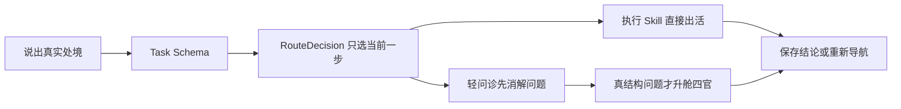

# 私域专家团 · 马甲实战版

[](https://github.com/maojiebc/majia-siyu-team/releases)
[](./LICENSE)
[](https://clawhub.ai/s/majia-siyu-team)
[](https://skills.sh/maojiebc/majia-siyu-team)

> **私域专家团 · 马甲实战版**
>
> **从日常文案直接干活、遇到结构问题再升舱诊断的中文私域工具箱。** 你只需记住 `/siyu`：它按当前处境选一个能力，干完再按真实结论导航下一步——不预设固定长链。


> **一张图看懂**：`/siyu` 每次只选当前一步；结构问题升舱后，四官各自独立采样、互不可见，团长主持只评推理质量、合规官红线一票否决，最终收口成可埋点、可交付客户的 playbook。全程由「企微官方文档 + 行业册 + 真实 SOP」三层知识库和工具链底座支撑。

## 解决什么问题

| 真实处境 | 直接产出 |
|---|---|
| 朋友圈写到枯竭，每天从零想素材 | 按内容配比排好的整周朋友圈文案，含时段、标签与**合规扫描** |
| 群发没人打开，活动通知越发越沉 | 栏目化群发脚本、首句 A/B、承接动作与「该救文案还是救机制」判断 |
| 新客加进来不知道第一句说什么 | 分场景欢迎语、破冰流程与高频答疑话术 |
| 有个具体私域问题，但不知道问题出在哪 | 五层问诊：先判断问题是否成立，再回答或升舱 |
| 整盘私域不知道怎么搭 | 团长调研 → 四官独立评审 → 主持收口成可执行 playbook |
| 上次结论散在聊天里，下次又要重讲 | 本地客户档案、跨对话接续与合规报告 |

## 与通用文案工具的区别

通用「生成」市面已到 80 分。这套补的是最后 20 分：

- **边写边合规** —— 合规不是发完再审，而是每个执行 skill 内置的前置扫描（`COMPLIANCE_RED` 就地打回，企微封号红线/广告法绝对化/群发诱导分享一律拦），生成端直接闭环。
- **行业方法内置** —— 餐饮 3322 朋友圈配比、造 IP 命名公式、偷着打折玩法等行业通行打法已装进 skill。
- **护城河留口** —— 真实卖点/优惠/SOP 由使用者注入私有层，输出从「行业通用」变「懂本品、能转化」。

## 能力一览

| 能力 | 什么时候用 | 产出 |
|---|---|---|
| `/siyu` | 不知道从哪开始 / 下一步怎么走 | 新手教程、任务路由、任务后导航 |
| `/siyu-pyq` | 写朋友圈、内容池、节日素材 | 可直接发的朋友圈文案（含合规扫描） |
| `/siyu-qunfa` | 群发、社群栏目、秒杀通知 | 群发脚本、承接动作、机制提醒 |
| `/siyu-huashu` | 欢迎语、破冰、答疑 | 分场景话术库 + 账号 IP 模板 |
| `siyu-wenzhen` | 转化/留存/加微等具体问题 | 五层问诊：消解问题或给明确处方 |
| `siyu-onboard` | 全盘诊断与战略评审 | 四官评审后的私域 playbook |
| `/siyu-save` · `/siyu-restore` · `/siyu-report` | 存/续/交付结论 | 本地客户档案与合规报告 |

## 快速开始

```text
/siyu
```

也可以直接说真实处境，不用先知道 skill 名：

```text
我给门店群发了三轮活动，打开率还是很低，下一步该先改文案还是改群机制？
```

## 安装

```bash
# ClawHub（装入口）
clawhub install majia-siyu-team

# skills.sh（从公开仓装全套）
npx -y skills add maojiebc/majia-siyu-team -g --all

# Claude Code marketplace（装全套）
claude plugin marketplace add maojiebc/majia-siyu-team
```

安装单元定义在 [`.claude-plugin/marketplace.json`](.claude-plugin/marketplace.json)。

## 怎样工作



- **计划层（代码边界）**：`Task → RouteDecision` 固定任务类型、渠道、目标、风险与缺失字段；信息不足时先补问。
- **执行层（入口·高频）**：`siyu-pyq` / `siyu-qunfa` / `siyu-huashu`，各自内置边写边合规。
- **诊断层（升舱·低频）**：四官先经过 `AgentContext` 白名单隔离，再由团长主持收口并过质量门。
- **共用底座**：原子状态、脱敏追踪、三层知识库、合规词库单一真源与连接器预留接口（未接入）。

当前 Runtime 说明见 [`docs/runtime-v0.4.md`](docs/runtime-v0.4.md)，完整能力图见 [`docs/framework.svg`](docs/framework.svg)；工程范式来源见 [`docs/标杆移植说明.md`](docs/标杆移植说明.md)。

## 方法论引擎：三句话

- **私域即公关** —— 私域是关系/口碑/信任场，不是收割场。
- **内容即产品** —— 每条内容都当有钩子、有承接、可复用的产品来做。
- **运营即广告** —— 每个运营动作本身就是广告，自带传播/转化，不刷屏不浪费触达。

## 开发与验证

```bash
make validate
make test
PYTHONPATH=src python3 -m siyu_team.eval.cli score <方案.md> --threshold 80
PYTHONPATH=src python3 -m siyu_team.cli "群发三轮没人打开，问题出在哪？" --industry catering
```

自然语言请求先进入结构化 Runtime，生成 `Task → RouteDecision → AgentContext`，再交给现有 Skill。运行追踪默认写入本地 `.siyu-team/traces/`，敏感字段、手机号、身份证号和 Bearer 凭据会在落盘前脱敏。能力定义的唯一真源是 `plugins/` 与 `src/siyu_team/`。质量门命中 `COMPLIANCE_RED` 直接失败，不交付。

## 📋 版本记录

- **v0.6.0** — 新增餐饮企业微信冷启动基建知识包：企微四件套（好友码/资料页/欢迎语/群活码）脱敏方法论、SCRM 选型阶梯与产品成本口径、老客迁移玩法卡；私有护城河层首建 23 条真实 SOP 原子。
- **v0.5.0** — 质量门四层落地（判官 + 蒙卡走 B 路径，宿主评分零 API）、连接器 keychain 骨架、四官方法框架补全、合规 lint 脱离 repo 降级兜底。
- **v0.4.1** — 安全与合规加固：脱敏补国家码/凭据字段名/裸 token/邮箱/老身份证；质量门纳入裂变诱导与隐私索取拦截；组件版本对齐；eval judge/蒙卡与连接器实装状态诚实化。

完整变更见 [CHANGELOG.md](./CHANGELOG.md)。

## 👤 作者 / 联系

**马甲（@maojiebc）** · 超级马甲

如果这份 skill 帮到你，欢迎在以下任意渠道找我交流踩坑实录、提需求、报 bug，也欢迎勾兑用户运营 / 数据中台 / BI 工程的实战经验：

| 渠道 | 链接 |
|---|---|
| 📧 Email | [m9224@163.com](mailto:m9224@163.com) |
| 🐙 GitHub | [github.com/maojiebc](https://github.com/maojiebc) |
| 🪝 ClawHub | [clawhub.ai/p/maojiebc](https://clawhub.ai/p/maojiebc) |
| 🐦 X | [@maojiebc](https://x.com/maojiebc) |
| 📕 小红书 | [超级马甲](https://xhslink.com/m/4fQMJeHHWKC) |
| 📰 微信公众号 | [超级马甲](https://mp.weixin.qq.com/mp/profile_ext?action=home&__biz=MzY5NzIzODk2NA==#wechat_redirect) |

> 这份 skill 是 14 年用户运营 + 数据中台 + BI 工程实战沉淀出来的，问题/合作随时聊。

## License

MIT © 2026 马甲 (maojiebc)。方法论框架与骨架开源；真实操盘 SOP 属作者私有，不在本仓。
