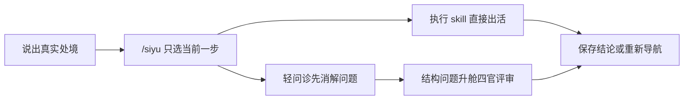

# 私域专家团 · 马甲实战版


一个从日常文案直接干活、遇到结构问题再升舱诊断的中文私域工具箱。用户只需记住 `/siyu`：它会根据当前处境选择一个能力，完成后再按真实结论导航下一步。

## 解决什么问题

| 真实处境 | 直接产出 |
|---|---|
| 朋友圈写到枯竭，每天从零想素材 | 一批按内容配比排好的朋友圈文案，含时段、标签与合规扫描 |
| 群发没人打开，活动通知越发越沉 | 栏目化群发脚本、首句 A/B、承接动作与机制提醒 |
| 新客加进来不知道第一句说什么 | 分场景欢迎语、破冰流程与高频答疑话术 |
| 有个具体私域问题，但不知道问题出在哪 | 五层问诊：先判断问题是否成立，再回答或升舱 |
| 整个私域盘不知道怎么搭 | 团长调研，四官独立评审，主持收口成可执行 playbook |
| 上次结论散在聊天里，下次又要重讲 | 本地客户档案、跨对话接续与合规报告 |

## 快速开始

安装后输入：

```text
/siyu
```

也可以直接说真实处境，不用先知道 skill 名：

```text
我给门店群发了三轮活动，打开率还是很低，下一步该先改文案还是改群机制？
```

`/siyu` 每次只决定当前一步。执行结果出来后，再输入一次 `/siyu`，它会读取具体结论继续导航，不预设固定长链。

## 能力一览

| 能力 | 适合什么时候用 | 产出 |
|---|---|---|
| `/siyu` | 不知道该从哪开始或下一步怎么走 | 新手教程、任务路由、任务后导航 |
| `/siyu-pyq` | 写朋友圈、内容池、节日素材 | 可直接发的朋友圈文案 |
| `/siyu-qunfa` | 群发、社群栏目、秒杀通知 | 群发脚本与承接动作 |
| `/siyu-huashu` | 欢迎语、破冰、答疑 | 分场景话术库 |
| `siyu-wenzhen` | 转化、留存、加微等具体问题 | 问题消解或明确处方 |
| `siyu-onboard` | 全盘诊断与战略评审 | 四官评审后的私域 playbook |
| `/siyu-save` | 想把结论留下 | 本地客户档案 |
| `/siyu-restore` | 想接着上次继续 | 最近状态与下一步 |
| `/siyu-report` | 要给老板或客户交付 | 合并存档后的合规 markdown 报告 |
| `/siyu-update` | 更新私域专家团 | 官方项目同步与重装 |

## 安装

### 公开仓库通道

```bash
npx -y skills add maojiebc/siyu-expert-team -g --all
```

### 私有仓库本地通道

```bash
npx -y skills add ~/Projects/siyu-expert-team -g --all
```

### Claude Code marketplace

```bash
claude plugin marketplace add ~/Projects/siyu-expert-team
```

然后按需安装 `siyu`、三个执行能力、客户档案、问诊或完整 `siyu-expert-panel`。正式安装单元定义在 [marketplace.json](.claude-plugin/marketplace.json)。

## 怎样工作



完整 skill 有向图见 [docs/skill-link-map.mmd](docs/skill-link-map.mmd)。

## 本地记录与知识库

- `.siyu-team/` 是一次团长编排的运行时状态，供断点续跑，完成后归档。
- `~/.siyu/clients/` 是跨对话客户档案，本地纯文本、未加密，不进入仓库。
- 高频案例留在 SKILL；深度方法论放 `knowledge/00-methodology/`；真实语料原子只放被 gitignore 的 `knowledge/03-majia-sop/atoms.jsonl`。
- 执行能力会优先查询私有原子库；没有真实语料时明确标注为通用示例，不编造客户事实。

## 开发与验证

```bash
make validate
python3 tools/check_versions.py
bash tools/build_skills.sh
PYTHONPATH=src python3 -m siyu_team.eval.cli score <方案.md> --threshold 80
```

能力定义的唯一真源是 `plugins/` 与 `src/siyu_team/`。质量门命中 `COMPLIANCE_RED` 时直接失败，不交付。

工程范式与标杆移植来源见 [docs/标杆移植说明.md](docs/标杆移植说明.md)；详细拆解保留在 `docs/teardowns/`。
