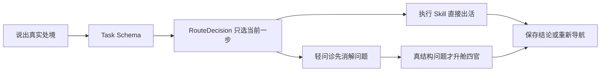

# 私域专家团 · 马甲实战版

[](https://github.com/maojiebc/majia-siyu-team/releases)
[](./LICENSE)
[](https://clawhub.ai/s/majia-siyu)
[](https://skills.sh/maojiebc/majia-siyu-team)

> **私域专家团 · 马甲实战版**
>
> **从日常文案直接干活、遇到结构问题再升舱诊断的中文私域工具箱。** 你只需记住 `/siyu`：它按当前处境选一个能力，干完再按真实结论导航下一步——不预设固定长链。


> **一张图看懂**：`/siyu` 每次只选当前一步；结构问题升舱后，四官各自独立采样、互不可见，团长主持只评推理质量、合规官红线一票否决，最终收口成可埋点、可交付客户的 playbook。全程由「企微官方文档 + 行业册 + 真实 SOP」三层知识库和工具链底座支撑。

## 解决什么问题

| 真实处境 | 直接产出 |
|---|---|
| 朋友圈写到枯竭，每天从零想素材 | 按内容配比排好的整周朋友圈文案，含时段、标签与**合规扫描** |
| 群发没人打开，活动通知越发越沉 | 栏目化群发脚本、首句 A/B、承接动作与「该救文案还是救机制」判断 |
| 新客加进来不知道第一句说什么 | 分场景欢迎语、破冰流程与高频答疑话术 |
| 有个具体私域问题，但不知道问题出在哪 | 五层问诊：先判断问题是否成立，再回答或升舱 |
| 要选厂商、比竞品或核对当前报价 | 实时检索、存续与产品状态分开核验、带链接和日期的证据快照 |
| 想把一次真实踩坑贡献给同行 | 结构化案例采集、授权范围选择和人工审核，不上传完整聊天 |
| 整盘私域不知道怎么搭 | 团长调研 → 四官独立评审 → 主持收口成可执行 playbook |
| 上次结论散在聊天里，下次又要重讲 | 本地客户档案、跨对话接续与合规报告 |

## 与通用文案工具的区别

通用「生成」市面已到 80 分。这套补的是最后 20 分：

- **边写边合规** —— 合规不是发完再审，而是每个执行 skill 内置的前置扫描（`COMPLIANCE_RED` 就地打回，企微封号红线/广告法绝对化/群发诱导分享一律拦），生成端直接闭环。
- **行业方法内置** —— 餐饮 3322 朋友圈配比、造 IP 命名公式、偷着打折玩法等行业通行打法已装进 skill。
- **护城河留口** —— 真实卖点/优惠/SOP 由使用者注入私有层，输出从「行业通用」变「懂本品、能转化」。

## 能力一览

| 能力 | 什么时候用 | 产出 |
|---|---|---|
| `/siyu` | 不知道从哪开始 / 下一步怎么走 | 新手教程、任务路由、任务后导航 |
| `/siyu-pyq` | 写朋友圈、内容池、节日素材 | 可直接发的朋友圈文案（含合规扫描） |
| `/siyu-qunfa` | 群发、社群栏目、秒杀通知 | 群发脚本、承接动作、机制提醒 |
| `/siyu-huashu` | 欢迎语、破冰、答疑 | 分场景话术库 + 账号 IP 模板 |
| `siyu-wenzhen` | 转化/留存/加微等具体问题 | 五层问诊：消解问题或给明确处方 |
| `siyu-market-research` | 厂商选型、竞品、报价、市场地图 | 带核验状态、日期与来源链接的证据快照 |
| `siyu-onboard` | 全盘诊断与战略评审 | 四官评审后的私域 playbook |
| `/siyu-save` · `/siyu-restore` · `/siyu-report` | 存/续/交付结论 | 本地客户档案与合规报告 |

## 快速开始

```text
/siyu
```

也可以直接说真实处境，不用先知道 skill 名：

```text
我给门店群发了三轮活动，打开率还是很低，下一步该先改文案还是改群机制？
```

## 安装

```bash
# WorkBuddy / CodeBuddy（推荐：只安装一个 majia-siyu 插件，完整能力一次到位）
/plugin marketplace add maojiebc/majia-siyu-team
/plugin install majia-siyu@majia-siyu

# ClawHub（装入口）
clawhub install majia-siyu

# SkillHub（沿用原条目，保留历史与统计）
skillhub install siyu

# skills.sh（从公开仓装全套）
npx -y skills add maojiebc/majia-siyu-team -g --all

# Claude Code marketplace（装全套）
claude plugin marketplace add maojiebc/majia-siyu-team
```

WorkBuddy / CodeBuddy 的单插件安装定义在 [`.codebuddy-plugin/plugin.json`](.codebuddy-plugin/plugin.json)，一次安装会统一带上入口、17 个能力、4 个专家 Agent 与编排命令；Claude Code 的安装单元仍定义在 [`.claude-plugin/marketplace.json`](.claude-plugin/marketplace.json)。

两个商店都只保留一个条目：ClawHub 使用 `majia-siyu`；SkillHub 为保留原条目的下载量、收藏与版本历史，继续沿用历史安装名 `siyu`。代码入口、WorkBuddy 插件和 GitHub 真源统一为 `majia-siyu`。发布前运行 `python3 tools/build_skillhub_bundle.py`，它会从当前仓库的模块真源生成自包含包到 `skillhub/majia-siyu/`：主入口位于根级，全部能力收进 `modules/` 供内部路由，不把子能力拆成零散商店条目。

## 同行知识共建（v1.2.1 邀请制 Pilot）

本轮只邀请小样本同行验证三件事：知识是否真能改善答案、案例卡与完整脱敏知识包是否构成有价值的交换、人工审核成本是否可持续。当前 H1/H2/H3 均尚未完成真实试验，不宣称已形成知识飞轮。

- [查看飞书同行共建知识库](https://supermjbc.feishu.cn/wiki/XdrvwbtIyif61Pku8yQcSCj6nWf)
- [填写 v1.2.1 真实案例采集表](https://supermjbc.feishu.cn/share/base/form/shrcnLsRQgaQJilUGNg6BjBXflg)
- [阅读贡献与授权说明](docs/community-knowledge/contributor-guide.md)
- [查看 Pilot 协议与当前结果状态](docs/pilot/README.md)

飞书公开入口已原位切换为 v1.2.1：保留同一分享链接，现为 7 个核心问题、5 项轻量元数据和 1 个语音/附件入口，共 13 题。切换前确认同步表无真实投稿，因此已清除 v1.2.0 的 21 题旧字段；未创建伪造试填记录。飞书仅用于采集和人工审核，不是 Runtime 实时真源。本版不启用自动批准、正式知识检索或 Runtime 注入。

## 怎样工作


```mermaid
flowchart LR
    A["说出真实处境"] --> B["Task Schema"]
    B --> C["RouteDecision 只选当前一步"]
    C --> D["执行 Skill 直接出活"]
    C --> E["轻问诊先消解问题"]
    E --> F["真结构问题才升舱四官"]
    D --> G["保存结论或重新导航"]
    F --> G
```

- **证据层（动态事实硬门）**：厂商、产品、报价、案例与政策先实时检索；候选对象来自本次检索，证据不足不得推荐。
- **计划层（代码边界）**：`Task → RouteDecision` 固定任务类型、渠道、目标、风险与缺失字段；信息不足时先补问。
- **执行层（入口·高频）**：`siyu-pyq` / `siyu-qunfa` / `siyu-huashu`，各自内置边写边合规。
- **诊断层（升舱·低频）**：四官先经过 `AgentContext` 白名单隔离，再由团长主持收口并过质量门。
- **共用底座**：原子状态、脱敏追踪、`KnowledgeAtomV2` 分层知识契约、prompt-once 贡献状态、合规词库单一真源与连接器预留接口（尚未接入线上提交/检索）。

当前 Runtime 说明见 [`docs/runtime-v0.4.md`](docs/runtime-v0.4.md)，Knowledge Runtime 契约见 [`docs/knowledge-runtime.md`](docs/knowledge-runtime.md)，完整能力图见 [`docs/framework.svg`](docs/framework.svg)；工程范式来源见 [`docs/标杆移植说明.md`](docs/标杆移植说明.md)。

## 方法论引擎：三句话

- **私域即公关** —— 私域是关系/口碑/信任场，不是收割场。
- **内容即产品** —— 每条内容都当有钩子、有承接、可复用的产品来做。
- **运营即广告** —— 每个运营动作本身就是广告，自带传播/转化，不刷屏不浪费触达。

## 开发与验证

```bash
make validate
make test
PYTHONPATH=src python3 -m siyu_team.pilot.cli validate --fixtures
PYTHONPATH=src python3 -m siyu_team.eval.cli score <方案.md> --threshold 80
PYTHONPATH=src python3 -m siyu_team.cli "群发三轮没人打开，问题出在哪？" --industry catering
```

自然语言请求先进入结构化 Runtime，生成 `Task → RouteDecision → AgentContext`，再交给现有 Skill。运行追踪默认写入本地 `.siyu-team/traces/`，敏感字段、手机号、身份证号和 Bearer 凭据会在落盘前脱敏。v1.2.1 新增的 `siyu-pilot` 只做离线 Prompt 准备、盲化、评分和审核报表，不调用模型或飞书 API，也不把 Atom 接入 Runtime。能力定义的唯一真源是 `plugins/` 与 `src/siyu_team/`。质量门命中 `COMPLIANCE_RED` 直接失败，不交付。

## 📋 版本记录

- **v1.2.1** — 新增离线知识价值盲测、30 个 Golden Tasks 和审核吞吐报表；同行共建收敛为邀请制验证，真实 H1/H2/H3 尚未执行。
- **v1.2.0** — 建立 `KnowledgeAtomV2` 契约与贡献预览/授权/隐私/幂等安全层，完成飞书六表治理和 21 题问卷 Phase 0；尚不自动上传或自动批准知识。
- **v1.1.0** — 新增动态外部事实三道硬门和 `siyu-market-research`；厂商、产品、价格与市场事实必须实时检索留证后才能进入推荐和专家分析。

完整变更见 [CHANGELOG.md](./CHANGELOG.md)。

## 👤 作者 / 联系

**马甲（@maojiebc）** · 超级马甲

如果这份 skill 帮到你，欢迎在以下任意渠道找我交流踩坑实录、提需求、报 bug，也欢迎勾兑用户运营 / 数据中台 / BI 工程的实战经验：

| 渠道 | 链接 |
|---|---|
| 📧 Email | [m9224@163.com](mailto:m9224@163.com) |
| 🐙 GitHub | [github.com/maojiebc](https://github.com/maojiebc) |
| 🪝 ClawHub | [clawhub.ai/p/maojiebc](https://clawhub.ai/p/maojiebc) |
| 🐦 X | [@maojiebc](https://x.com/maojiebc) |
| 📕 小红书 | [超级马甲](https://xhslink.com/m/4fQMJeHHWKC) |
| 📰 微信公众号 | [超级马甲](https://mp.weixin.qq.com/mp/profile_ext?action=home&__biz=MzY5NzIzODk2NA==#wechat_redirect) |

> 这份 skill 是 14 年用户运营 + 数据中台 + BI 工程实战沉淀出来的，问题/合作随时聊。

## License

MIT © 2026 马甲 (maojiebc)。方法论框架与骨架开源；真实操盘 SOP 属作者私有，不在本仓。
