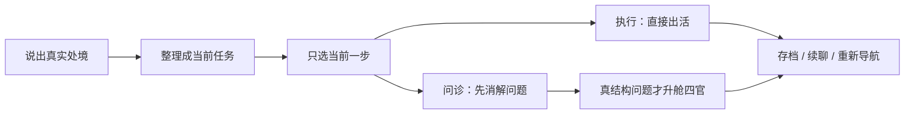

# 私域专家团 · 马甲实战版

[](https://github.com/maojiebc/majia-siyu-team/releases)
[](./LICENSE)
[](https://clawhub.ai/s/majia-siyu)
[](https://skillhub.cn)
[](https://skills.sh/maojiebc/majia-siyu-team)
[](https://github.com/maojiebc/majia-siyu-team/releases)

> **私域专家团 · 马甲实战版**
>
> 中文私域经营工具箱。日常文案直接出活，结构问题再升舱诊断。你只需记住一个入口：`/siyu`。

<p align="center">
  
</p>

<p align="center">
  
</p>

> **一张图看懂**：说真实处境 → `/siyu` 只选当前最该做的一步 → 高频任务直接写朋友圈 / 群发 / 话术（边写边合规）→ 真结构问题才升舱四官评审 → 结论可存档、可续聊、可出报告。经营动作归本仓；会员指标 / SQL / 数仓请用 [majia-huiyuan](https://github.com/maojiebc/majia-huiyuan)。

---

**你是谁，直接去哪里：**

| 我想做的事 | 直接去 |
|---|---|
| 第一次用，不知道从哪开始 | 下方 [30 秒上手](#30-秒上手) → 输入 `/siyu` |
| 写本周朋友圈 / 群发 / 欢迎语 | [能力地图 · 高频执行](#2-高频执行--边写边合规) |
| 转化差、群不活跃、不知道问题在哪 | [能力地图 · 问诊与调研](#3-问诊与调研) |
| 要选 SCRM / 比竞品 / 核报价 | `siyu-market-research`（实时检索留证） |
| 整盘私域不知道怎么搭 | 店老板 → 老板版向导；专业运营 → `siyu-onboard` |
| 上次结论散了，想接着聊 / 出客户报告 | `/siyu-save` · `/siyu-restore` · `/siyu-report` |
| 用 AI Agent 安装整套能力 | 下方 [安装](#安装) |
| 想贡献一条真实踩坑案例 | [同行共建](#同行知识共建邀请制) |

---

## 这是什么

做私域的人天天卡在三类活：

1. **每天都要写** —— 朋友圈、群发、欢迎语，写到枯竭还怕踩合规红线  
2. **偶尔要判断** —— 转化差到底是文案问题还是机制问题；厂商 / 报价能不能信  
3. **少但很重** —— 整盘怎么搭、客户结论怎么存、下次怎么接续  

市面文案工具大多只做第 1 类的前 80 分。这套补的是最后 20 分，并把 2、3 类一起接住：

- **一个入口**：不知道下一步就回 `/siyu`，不用背 17 个 skill 名  
- **边写边合规**：企微封号红线 / 广告法绝对化 / 诱导分享，生成前就拦  
- **动态事实硬门**：厂商、产品、报价、政策先实时检索留证，证据不足不推荐  
- **结构问题才升舱**：四官独立评审、合规官红线一票否决，不把小问题做成大咨询  
- **结论可接力**：本地客户档案存 / 续 / 出报告，下次不用重讲一遍  

> 本仓开源的是框架、方法论与可安装 Skill；真实客户操盘 SOP 属作者私有，不在公开库。

## 解决什么问题

| 真实处境 | 直接产出 |
|---|---|
| 朋友圈写到枯竭，每天从零想素材 | 按配比排好的整周朋友圈（时段、标签、合规扫描） |
| 群发没人打开，活动通知越发越沉 | 栏目化群发脚本、首句 A/B、承接动作，并判断该救文案还是救机制 |
| 新客加进来不知道第一句说什么 | 分场景欢迎语、破冰流程、高频答疑话术 |
| 有具体私域问题，但说不清卡在哪 | 五层问诊：先判断问题是否成立，再给处方或升舱 |
| 要选厂商、比竞品、核当前报价 | 带链接、日期与核验状态的证据快照 |
| 整盘私域不知道怎么搭 | 老板版讲人话向导，或四官评审后的可执行方案 |
| 上次结论散在聊天里，下次又要重讲 | 本地客户档案 + 跨对话接续 + 合规扫描后的交付报告 |
| 想把一次真实踩坑贡献给同行 | 结构化案例卡、授权范围选择、人工审核（不上传完整聊天） |

## 与「又一个文案 AI」的区别

| | 通用文案工具 | 私域专家团 |
|---|---|---|
| 入口 | 每次重新描述任务 | 一个 `/siyu`，干完自动导航下一步 |
| 合规 | 发完再审，或不管 | **写的时候就扫**，红线就地打回 |
| 行业方法 | 通用模板 | 餐饮 3322 配比、造 IP、偷着打折等内置打法 |
| 外部事实 | 模型记忆瞎填 | 厂商 / 报价 / 政策必须**本次检索留证** |
| 结构问题 | 继续堆文案 | 先问诊消解；真结构问题才升舱四官 |
| 跨对话 | 聊完就散 | 本地存档 / 续聊 / 出报告 |

护城河口子也留好了：真实卖点、优惠、本品 SOP 由你注入私有层，输出从「行业通用」变成「懂本品、能转化」。

## 能力地图

一次安装拿到完整能力。你不必全记，路由会按处境挑选；下表方便人肉查找。

### 1. 统一入口

| 能力 | 什么时候用 | 产出 |
|---|---|---|
| `/siyu` | 不知道从哪开始 / 下一步怎么走 | 新手教程、任务路由、任务后导航 |
| `/siyu-update` | 升级私域专家团 | 同步官方项目；不碰本地客户档案 |

### 2. 高频执行 · 边写边合规

| 能力 | 什么时候用 | 产出 |
|---|---|---|
| `/siyu-pyq` | 写朋友圈、内容池、节日素材 | 可直接发的朋友圈文案 |
| `/siyu-qunfa` | 群发、社群栏目、秒杀通知 | 群发脚本、承接动作、机制提醒 |
| `/siyu-huashu` | 欢迎语、破冰、答疑 | 分场景话术库 + 账号 IP 模板 |

### 3. 问诊与调研

| 能力 | 什么时候用 | 产出 |
|---|---|---|
| `siyu-wenzhen` | 转化 / 留存 / 加微等具体问题 | 五层问诊：消解问题或给明确处方 |
| `siyu-market-research` | 厂商选型、竞品、报价、市场地图 | 带核验状态、日期与来源链接的证据快照 |

### 4. 全盘诊断（低频）

| 能力 | 什么时候用 | 产出 |
|---|---|---|
| `siyu-onboard` | 整盘怎么搭、战略级私域评审 | 四官独立评审后的可执行方案 |
| 方法库（随诊断调用） | IP / 促活 / 漏斗 / 危机 / 合规深挖 | `trust-asset` · `content-as-product` · `reactivation` · `ops-as-ad-funnel` · `conversion-caliber` · `crisis-response` · `wechat-compliance-redlines` |

### 5. 客户档案

| 能力 | 什么时候用 | 产出 |
|---|---|---|
| `/siyu-save` | 把结论留下 | 写入本地客户档案 |
| `/siyu-restore` | 接着上次聊 | 拉出最近档案并续跑 |
| `/siyu-report` | 打包给老板或客户 | 合并多份存档 + 合规扫描报告 |

WorkBuddy / CodeBuddy 一次安装 = **17 个能力 + 4 位专家 Agent + 编排命令**。ClawHub / SkillHub 是同一份自包含入口包：子能力在包内路由，不拆成一堆商店条目。

## 30 秒上手

```text
/siyu
```

也可以直接说处境，不用先记 skill 名：

```text
我给门店群发了三轮活动，打开率还是很低，下一步该先改文案还是改群机制？
```

```text
帮我写下周朋友圈，主推周末双人套餐，受众是附近上班族。
```

```text
对比几家餐饮 SCRM，我要看清哪个还在售、大概什么价、有没有坑。
```

## 安装

### WorkBuddy / CodeBuddy（推荐）

只装一个插件，完整专家团一次到位：

```bash
/plugin marketplace add maojiebc/majia-siyu-team
/plugin install majia-siyu@majia-siyu
```

清单见 [`.codebuddy-plugin/plugin.json`](.codebuddy-plugin/plugin.json)。

### ClawHub / SkillHub（自包含单入口）

```bash
clawhub install majia-siyu
skillhub install siyu
```

两个商店都只保留一个条目：ClawHub slug 为 `majia-siyu`；SkillHub 为保留历史下载量 / 收藏 / 版本记录，继续用历史安装名 `siyu`。**对外标题一律是「私域专家团 · 马甲实战版」**（H1 / displayName），不要把 `siyu` 或 `majia-siyu` 当成卡片标题。代码入口、WorkBuddy 插件与 GitHub 真源统一为 `majia-siyu`。

### skills.sh / Claude Code

```bash
npx -y skills add maojiebc/majia-siyu-team -g --all
claude plugin marketplace add maojiebc/majia-siyu-team
```

Claude Code 安装单元见 [`.claude-plugin/marketplace.json`](.claude-plugin/marketplace.json)。发布包由 `python3 tools/build_skillhub_bundle.py` 从模块真源生成到 `skillhub/majia-siyu/`，保证 GitHub / ClawHub / SkillHub 对应同一 commit。

## 怎样工作


```mermaid
flowchart LR
    A["说出真实处境"] --> B["整理成当前任务"]
    B --> C["只选当前一步"]
    C --> D["执行：直接出活"]
    C --> E["问诊：先消解问题"]
    E --> F["真结构问题才升舱四官"]
    D --> G["存档 / 续聊 / 重新导航"]
    F --> G
```

用人话讲五层：

1. **证据层** —— 厂商、产品、报价、案例、政策先实时检索；候选名单也必须来自本次检索，证据不足不推荐  
2. **计划层** —— 先把自然语言收成结构化任务，信息不够只问最关键的一个问题  
3. **执行层** —— 朋友圈 / 群发 / 话术高频直出，各自内置合规扫描  
4. **诊断层** —— 结构问题才进四官；四官互不可见，团长只评推理质量，合规官可一票否决  
5. **底座** —— 本地状态、脱敏追踪、分层知识契约、连接器预留（线上提交 / 检索尚未默认打开）

技术细节：[`docs/runtime-v0.4.md`](docs/runtime-v0.4.md) · [`docs/knowledge-runtime.md`](docs/knowledge-runtime.md) · [`docs/framework.svg`](docs/framework.svg) · [`docs/标杆移植说明.md`](docs/标杆移植说明.md)

## 同行知识共建（邀请制）

当前是小样本验证，**不宣称已形成知识飞轮**。只验证三件事：知识能否改善答案、案例卡是否值得交换、人工审核是否扛得住。

- [飞书同行共建知识库](https://supermjbc.feishu.cn/wiki/XdrvwbtIyif61Pku8yQcSCj6nWf)
- [v1.2.x 真实案例采集表](https://supermjbc.feishu.cn/share/base/form/shrcnLsRQgaQJilUGNg6BjBXflg)
- [贡献与授权说明](docs/community-knowledge/contributor-guide.md)
- [Pilot 协议与结果状态](docs/pilot/README.md)

飞书只负责采集和人工审核，不是 Runtime 真源。本版不启用自动批准、正式知识检索或 Runtime 注入。

## 方法论引擎：三句话

- **私域即公关** —— 私域是关系 / 口碑 / 信任场，不是收割场  
- **内容即产品** —— 每条内容都要有钩子、有承接、可复用  
- **运营即广告** —— 每个运营动作本身就是广告，自带传播与转化  

## 开发与验证

```bash
make check          # test + validate + pilot + 版本/一致性
make test
make validate
make pilot
PYTHONPATH=src python3 -m siyu_team.cli "群发三轮没人打开，问题出在哪？" --industry catering
```

能力真源在 `plugins/` 与 `src/siyu_team/`。运行追踪默认写本地 `.siyu-team/traces/`，落盘前脱敏。命中合规红线直接失败，不交付。

## 📋 版本记录

- **v1.2.4** — 公开「用增方法映射·餐饮零售」：16 条增长 Know-how、指标字典、九项体检；方法可挂问诊/漏斗/促活，仍不自动注入 Runtime。  
- **v1.2.3** — 修复 SkillHub 详情页标题：发布临时包对齐 name=slug，主标题显示「私域专家团 · 马甲实战版」。功能不变。  
- **v1.2.2** — 公开首页全面重梳：角色导航、完整能力地图、安装分渠道、ClawHub 包页与中英文 README 对齐；功能与 API 不变。  
- **v1.2.1** — 离线知识价值盲测、30 个 Golden Tasks、审核吞吐报表；同行共建为邀请制验证。  
- **v1.2.0** — `KnowledgeAtomV2` 契约与贡献安全层，飞书 Phase 0；不自动上传或批准知识。  
- **v1.1.0** — 动态外部事实硬门 + `siyu-market-research`。  

完整变更见 [CHANGELOG.md](./CHANGELOG.md)。

## 👤 作者 / 联系

**马甲（@maojiebc）** · 超级马甲

如果这份 skill 帮到你，欢迎在以下任意渠道找我交流踩坑实录、提需求、报 bug，也欢迎勾兑用户运营 / 数据中台 / BI 工程的实战经验：

| 渠道 | 链接 |
|---|---|
| 📧 Email | [m9224@163.com](mailto:m9224@163.com) |
| 🐙 GitHub | [github.com/maojiebc](https://github.com/maojiebc) |
| 🪝 ClawHub | [clawhub.ai/p/maojiebc](https://clawhub.ai/p/maojiebc) |
| 🐦 X | [@maojiebc](https://x.com/maojiebc) |
| 📕 小红书 | [超级马甲](https://xhslink.com/m/4fQMJeHHWKC) |
| 📰 微信公众号 | [超级马甲](https://mp.weixin.qq.com/mp/profile_ext?action=home&__biz=MzY5NzIzODk2NA==#wechat_redirect) |

> 这份 skill 是 14 年用户运营 + 数据中台 + BI 工程实战沉淀出来的，问题/合作随时聊。

## License

MIT © 2026 马甲 (maojiebc)。方法论框架与骨架开源；真实操盘 SOP 属作者私有，不在本仓。
